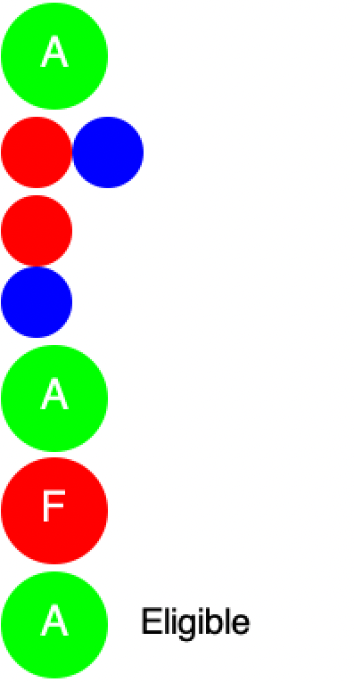

1. Төслийн зорилго:
Сурагчийн дүнг шалгаж, тэнцсэн төлөвийг нь өнгөт карт болгон зурах систем бүтээх.
2. Function бүр юу хийдэг, аль function-ийг дууддаг.
sum3: Гурван тооны нийлбэрийг олно.
average3: Гурван тооны дундажийг олно (sum3-г дуудна).
assignment-percent: Хийсэн болон нийт даалгаврын харьцаанаас гүйцэтгэлийн хувийг олно.
passing-average?: Дундаж оноо 60 болон түүнээс дээш эсэхийг шалгана (average3-г дуудна).
good-attendance?: Ирц 80% болон түүнээс дээш эсэхийг шалгана.
assignments-complete?: Даалгаврын гүйцэтгэл 70% болон түүнээс дээш эсэхийг шалгана (assignment-percent-ийг дуудна).
eligible?: Бүх шалгуур хангагдсан эсэхийг and логикоор шалгана (passing-average?, good-attendance?, assignments-complete?-г дуудна).
final-status: Шалгуур хангасан эсэхээс хамаарч Eligible эсвэл Not eligible гэсэн текстийг буцаана (eligible?-г дуудна).
letter-grade: Өгөгдсөн оноонд тохирох үсгэн дүнг тодорхойлно.
student-grade: Гурван онооны дунджаар үсгэн дүнг гаргана (average3, letter-grade-г дуудна).
grade-color: Оноонд тохирох өнгөний нэрийг буцаана.
grade-badge: Үсгэн дүн болон өнгөт тойргийг давхарлаж тэмдэг үүсгэнэ (letter-grade, grade-color-г дуудна).
student-card: Сурагчийн оноо болон статусыг багтаасан картын зургийг гаргана (average3, grade-badge, final-status-г дуудна).
3. Нэг тэнцсэн, нэг тэнцээгүй дуудлагын trace.
Тэнцсэн үйлдэл (Eligible)
(eligible? 80 90 70 85 8 10)
(passing-average? 80 90 70) -> average3 = 80 -> #t
(good-attendance? 85) -> #t
(assignments-complete? 8 10) -> assignment-percent = 80 -> #t
(and #t #t #t) -> #t

Тэнцээгүй үйлдэл (Not eligible - Ирц хүрээгүй)
(eligible? 80 90 70 79 8 10)
(passing-average? 80 90 70) -> #t
(good-attendance? 79) -> #f
and нэг #f олмогц зогсоно, assignments-complete? бодогдохгүй -> #f

4. Зассан алдаа яаж зассан 
Эхэнд eligible? функцийг бичих явцад бүх шалгуурыг or нөхцөлөөр холбочихсон байснаас болж ирц эсвэл даалгавар дутуу байсан ч тэнцсэн үр дүн гарч байсан. Үүнийг шалгуур бүр заавал байх ёстой тул or-ыг and болгон өөрчилж алдааг амжилттай зассан.

5. (Student Card Screenshot)

6. Өнөөдөр сурсан нэг зүйл
DrRacket хэл дээр 2htdp/image сангийн тусламжтайгаар зөвхөн текст, тоо бус өнгө, дүрс, текст хослуулсан хэлбэржүүлсэн зургийн утга үүсгэж, тэдгээрийг функцээр дамжуулан динамикаар карт болгон зурах боломжтой болсон нь маш сонирхолтой байсан.